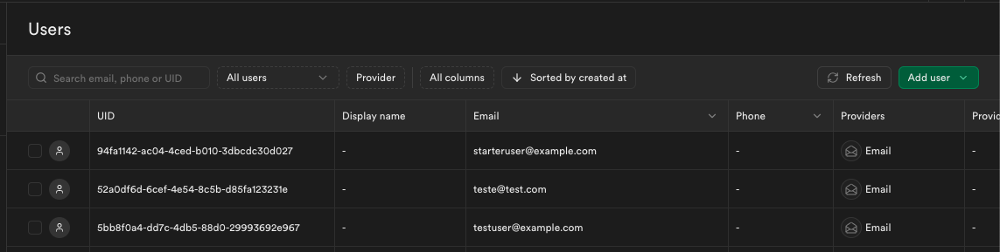

Para fazer os testes do projeto, temos de fazer o clone do repositório, após fazer o clone do projeto, é necessário instalar o npm e a biblioteca de ícones pelos comandos no terminal, nesta ordem:

```bash
npm install
npm install lucide-react
```

Agora, faremos a ligação com o supabase, que por sua vez é necessário criar uma conta e um projeto no site supabase.com, então podemos criar um novo arquivo no projeto chamado ".env.local" que irá conter a url e a key do projeto, e instalar o supabase no projeto:

```bash
npm install @supabase/supabase-js
```

Após a instalação do supabase, para testar a autenticação, há de se fazer a criação de um usuário teste no site do supabase, criando um email e senha para o usuário teste.

Por fim, os comandos para rodar a aplicação são:

```bash
npm run dev
# ou
yarn dev
# ou
pnpm dev
# ou
bun dev
```

Prints da aplicação do Back-end:

Acesso por plano


Auth


RPC FUNC

